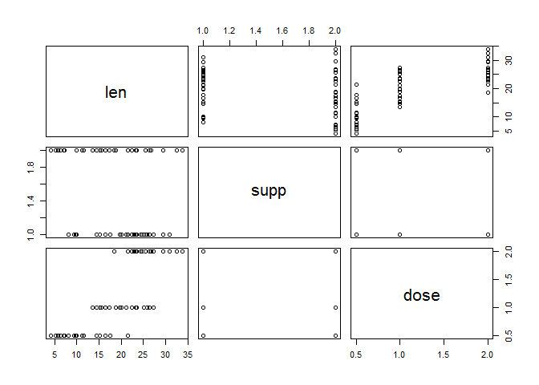

**Statistical Inference Course Project (Part 2)**

Note: Code for this document available at https://github.com/robbinsr/siProjPart2.

**Instructions**

1. Load the ToothGrowth data and perform some basic exploratory data analyses 
2. Provide a basic summary of the data.
3. Use confidence intervals and/or hypothesis tests to compare tooth growth by supp and dose. (Only use the techniques from class, even if there's other approaches worth considering)
4. State your conclusions and the assumptions needed for your conclusions. 

**Executive Summary**

The ToothGrowth data was captured during an experiment. The experiment captured tooth length information before and after vitamin C was administered to sixty guinea pigs. Vitamin C was provided using two differing delivery mechanisms (orange juice and absorbic acid) and three different dosage levels (0.5, 1, and 2 milligrams) to six different groups of ten subject guinea pigs. 

It is possible that the underlying populations of the samples of observations that varied by delivery mechanism (orange juice vs. ascorbic acid) are different in their tooth growth rates. However, this variation, as described by measurements collected and placed in this data set do not show a statistically significant difference in the growth rates, when compared by Vitamin C delivery method. 

However, it is entirely possible that the underlying populations of the samples of observations that varied by dosage levels (between 0.5 mm and 1 mm, as well as between 1 mm and 2 mm) varied in their tooth growth rates. Explicitly, it is entirely possible that guinnea pigs that are provided Vitamin C at 2 mm per dose have faster growing teeth then those given 1 mm per dose. This relationship also holds between guinea pigs with 1 mm vs. 005 mm dose amounts.

Note that these results are tentative because of the following reason. The sample sizes, ten in any group, is very small. Larger sample sizes would have provided more information that could be relied upon to make stronger claims. While the possible error related to accepting the null hypotheses incorrectly (that there wasn't a difference between any two groups) was considered, the possible error related to accepting the alternative hypothesis incorrectly, was not considered. It was not considered, because the standard method for addressing this risk, is increasing sample size. In this situation, the data was provided to I the analyst, and I did not have access to the experiment which occurred before 1952, which was fourteen years before I was born. Nonetheless, in an ideal world, I would have rerun the experiment with many more guinnea pigs.

**Results**

Question 1: Did guinea pigs that received vitamin C via orange juice grow teeth faster than those who received vitamin C in ascorbic acid? When the two groups' averages were compared, they were not statistically different, since t-score is not greater than t-critical, the p-value is greater than alpha, and mean difference of zero is within the confidence interval. 

Question 2: However, when the subjects receiving orange juice were tested to see whether their mean was greater than the mean of those subjects receiving ascorbic acid, a small effect was seen, as evidenced by the t-score that is somewhat greater than the t-critical, the p-value which is somewhat less than alpha, and the fact that a mean difference of zero was not in the confidence interval. However, the confidence interval of prospective mean differences did reach close to zero.

Question 3: The two groups (those receiving 2mm and those receiving 1mm doses) did not have a difference of means that could be explained only by chance. The t-score value was greater than the t-critical value, the p-value was less than the alpha value, and the estimated difference in means ranged from 3.74 length units to 8.99 units.

Question 4: The results were the same as question 3, but the test indicated that the 1 milligram difference in dosage levels created faster tooth growth.

Question 5: The two groups (those receiving 2mm and those receiving 1mm doses) did not have a difference of means that could be explained only by chance. The t-score value was greater than the t-critical value, the p-value was less than the alpha value, and the estimated difference in means ranged from 6.28 length units to 11.98 units.

Question 6: The results were the same as question 5, but the test indicated that the 0.5 milligram difference in dosage levels created faster tooth growth.

<!-- Start Styles. Move the 'style' tags and everything between them to between the 'head' tags -->
<style type="text/css">
.myTable { width:100%;background-color:#eee;border-collapse:collapse; }
.myTable th { background-color:#000;color:white; }
.myTable td, .myTable th { padding:5px;border:1px solid #000; }
</style>
<!-- End Styles -->
<table class="myTable">
<tr>
<th >#</th><th>Null</th><th>Alt</th><th>t-score</th><th>t-crit</th>
<th>p-value</th><th>alpha</th><th>conf-int</th><th>Reject Null?</th>
</tr>
<tr>
<td>1</td><td>OJ = VC</td><td>OJ not = VC</td>
<td>1.92</td><td>2.00</td>
<td>0.06</td><td>.05</td>
<td>-0.16, 7.56</td><td>no</td>
</tr>
<tr>
<td>2</td><td>OJ <= VC</td><td>OJ > VC</td>
<td>1.92</td><td>1.67</td>
<td>.03</td><td>.05</td>
<td>0.4708, Inf</td><td>yes</td>
</tr>
<tr>
<td>3</td><td>2mm = 1mm</td><td>2mm not = 1mm</td>
<td>4.90</td><td>2.00</td>
<td><.00001</td><td>.05</td>
<td>3.74, 8.99</td><td>yes</td>
</tr>
<tr>
<td>4</td><td>2mm <= 1mm</td><td>2mm > 1mm</td>
<td>4.90</td><td>1.67</td>
<td><.00001</td><td>.05</td>
<td>4.17, Inf</td><td>yes</td>
</tr>
<tr>
<td>5</td><td>1mm = 0.5mm</td><td>1mm not = 0.5mm</td><td>6.48</td><td>2.00</td><td><.00001</td><td>.05</td>
<td>6.28, 11.98</td><td>yes</td>
</tr>
<tr>
<td>6</td><td>1mm <= 0.5mm</td><td>1mm > 0.5mm</td><td>6.48</td><td>1.67</td><td><.000001</td><td>.05</td>
<td>6.75, Inf</td><td>yes</td>
</tr>
</table>
<br>
<br>
<br>
<br>
<br>
<br>
<br>
<br>
<br>
<br>
<br>
<br>
<br>
<br>
<br>
<br>
<br>
<br>
<br>
<br>
<br>
<br>
<br><br>
<br>
<br>

**Appendix**

1. Load the ToothGrowth data and perform some basic exploratory data analyses 

```
## [1] VC OJ
## Levels: OJ VC
```

```
## [1] 0.5 1.0 2.0
```

 

2. Provide a basic summary of the data.

```
##       len        supp         dose      
##  Min.   : 4.20   OJ:30   Min.   :0.500  
##  1st Qu.:13.07   VC:30   1st Qu.:0.500  
##  Median :19.25           Median :1.000  
##  Mean   :18.81           Mean   :1.167  
##  3rd Qu.:25.27           3rd Qu.:2.000  
##  Max.   :33.90           Max.   :2.000
```
3. Use confidence intervals and/or hypothesis tests to compare tooth growth by supp and dose. (Only use the techniques from class, even if there's other approaches worth considering). 


First Question &nbsp;&nbsp;|&nbsp; Null: meanOJ - meanVC =  0 &nbsp;&nbsp;|&nbsp; Alternative: Mean-OJ - Mean_VC != 0

```r
ojEqVc<-t.test(x=OJ$len,y=VC$len,var.equal=TRUE,conf.level=0.95,paired=FALSE,alternative=c("two.sided"))
ojEqVc
```

```
## 
## 	Two Sample t-test
## 
## data:  OJ$len and VC$len
## t = 1.9153, df = 58, p-value = 0.06039
## alternative hypothesis: true difference in means is not equal to 0
## 95 percent confidence interval:
##  -0.1670064  7.5670064
## sample estimates:
## mean of x mean of y 
##  20.66333  16.96333
```
Second Question &nbsp;&nbsp;|&nbsp; Null: meanOJ - meanVC <=  0 &nbsp;&nbsp;|&nbsp; Alternative: meanOJ - meanVC >  0

```r
ojGtVc<-t.test(x=OJ$len,y=VC$len,var.equal=TRUE,conf.level=0.95,paired=FALSE,alternative=c("greater"))
ojGtVc
```

```
## 
## 	Two Sample t-test
## 
## data:  OJ$len and VC$len
## t = 1.9153, df = 58, p-value = 0.0302
## alternative hypothesis: true difference in means is greater than 0
## 95 percent confidence interval:
##  0.4708204       Inf
## sample estimates:
## mean of x mean of y 
##  20.66333  16.96333
```
Third Question &nbsp;&nbsp;|&nbsp; Null: mean2 - mean1 =  0 &nbsp;&nbsp;|&nbsp; Alternative: Mean-2 - Mean_1 != 0

```r
twoEqOne<-t.test(x=Two$len,y=One$len,var.equal=TRUE,conf.level=0.95,paired=FALSE,alternative=c("two.sided"))
twoEqOne
```

```
## 
## 	Two Sample t-test
## 
## data:  Two$len and One$len
## t = 4.9005, df = 38, p-value = 1.811e-05
## alternative hypothesis: true difference in means is not equal to 0
## 95 percent confidence interval:
##  3.735613 8.994387
## sample estimates:
## mean of x mean of y 
##    26.100    19.735
```
Fourth Question &nbsp;&nbsp;|&nbsp; Null: mean2 - mean1 <=  0 &nbsp;&nbsp;|&nbsp; Alternative: Mean-2 - Mean_1 > 0

```r
twoGtOne<-t.test(x=Two$len,y=One$len,var.equal=TRUE,conf.level=0.95,paired=FALSE,alternative=c("greater"))
twoGtOne
```

```
## 
## 	Two Sample t-test
## 
## data:  Two$len and One$len
## t = 4.9005, df = 38, p-value = 9.054e-06
## alternative hypothesis: true difference in means is greater than 0
## 95 percent confidence interval:
##  4.175196      Inf
## sample estimates:
## mean of x mean of y 
##    26.100    19.735
```
Fifth Question &nbsp;&nbsp;|&nbsp; Null: mean-1 - mean-Zero.5 =  0 &nbsp;&nbsp;|&nbsp; Alternative: Mean-1 - Mean-Zero.5 != 0

```r
oneEqZero.5<-t.test(x=One$len,y=Zero.5$len,var.equal=TRUE,conf.level=0.95,paired=FALSE,alternative=c("two.sided"))
oneEqZero.5
```

```
## 
## 	Two Sample t-test
## 
## data:  One$len and Zero.5$len
## t = 6.4766, df = 38, p-value = 1.266e-07
## alternative hypothesis: true difference in means is not equal to 0
## 95 percent confidence interval:
##   6.276252 11.983748
## sample estimates:
## mean of x mean of y 
##    19.735    10.605
```
Sixth Question &nbsp;&nbsp;|&nbsp; Null: mean-1 - mean-Zero.5 <=  0 &nbsp;&nbsp;|&nbsp; Alternative: Mean-1 - Mean-Zero.5 > 0

```r
oneGtZero.5<-t.test(x=One$len,y=Zero.5$len,var.equal=TRUE,conf.level=0.95,paired=FALSE,alternative=c("greater"))
oneGtZero.5
```

```
## 
## 	Two Sample t-test
## 
## data:  One$len and Zero.5$len
## t = 6.4766, df = 38, p-value = 6.331e-08
## alternative hypothesis: true difference in means is greater than 0
## 95 percent confidence interval:
##  6.753344      Inf
## sample estimates:
## mean of x mean of y 
##    19.735    10.605
```

